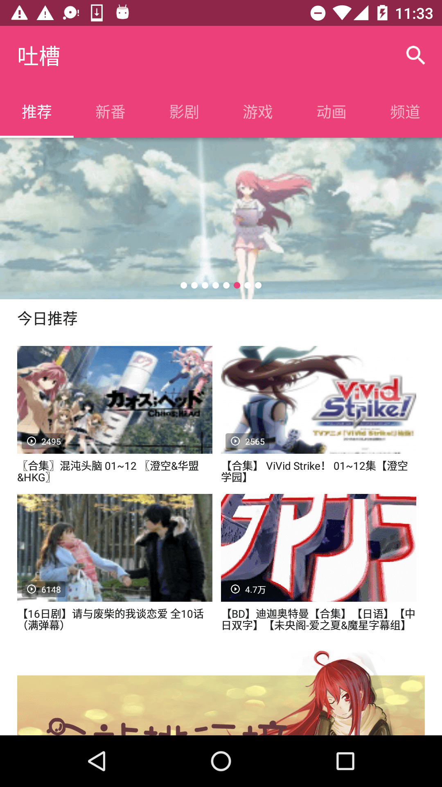

# Tucao

## Features
- 首页六大模块，推荐、新番、影剧、游戏、动画、频道
- 全站排行榜，支持每日/每周排序
- 放映时间表，可以查看周一到周日新番的更新情况
- 频道列表，支持按照发布时间/播放量/弹幕排序
- 视频搜索，支持分频道搜索
- 视频查看，使用IjkPlayer播放视频，DanmakuFlameMaster播放弹幕，自动拼接多段视频（使用concat协议）
- 视频离线缓存

## Screenshots

## TODO
- [x] 修复`天上掉下个小本本`不能播放的问题 (V1.0.7)
- [x] 放映时间表随日期动态变化 (V1.0.7)
- [x] 发送弹幕 (V1.0.7)
- [x] 记录播放进度 (V1.0.7)
- [ ] 播放速度 (V1.0.7)
- [ ] 评论 (V1.0.7)
- [ ] 弹幕屏蔽功能（V1.0.8）
- [ ] 登陆（V1.0.8）
- [ ] 更新接口(无限期延后)

## UpdateLog
- [更新历史](https://github.com/blackbbc/Tucao/blob/master/changelog.md)

## Instructions
- 设计编码均独立完成，如果你觉得太丑，欢迎砸设计稿
- 架构基于MVVM模式，使用`DataBinding` + `RxJava2` + `Dagger2` + `Retrofit`实现

## Statement
该项目仅供交流学习使用，如果该项目有侵犯Tucao版权问题，本人会及时删除此页面与整个项目。

## Thanks to the open source project
- [Kotlin](https://github.com/JetBrains/kotlin)
- [RxJava](https://github.com/ReactiveX/RxJava)
- [RxLifecycle](https://github.com/trello/RxLifecycle)
- [RxDownload](https://github.com/ssseasonnn/RxDownload)
- [Retrofit](https://github.com/square/retrofit)
- [Dagger2](https://github.com/google/dagger)
- [EventBus](https://github.com/greenrobot/EventBus)
- [GSYVideoPlayer](https://github.com/CarGuo/GSYVideoPlayer)
- [ijkplayer](https://github.com/Bilibili/ijkplayer)
- [DanmakuFlameMaster](https://github.com/Bilibili/DanmakuFlameMaster)
- [Glide](https://github.com/bumptech/glide)
- [BaseRecyclerViewAdapterHelper](https://github.com/CymChad/BaseRecyclerViewAdapterHelper)
- [CrashWoodpecker](https://github.com/drakeet/CrashWoodpecker)
- [Leakcanary](https://github.com/square/leakcanary)
- [Convenientbanner](https://github.com/saiwu-bigkoo/Android-ConvenientBanner)
