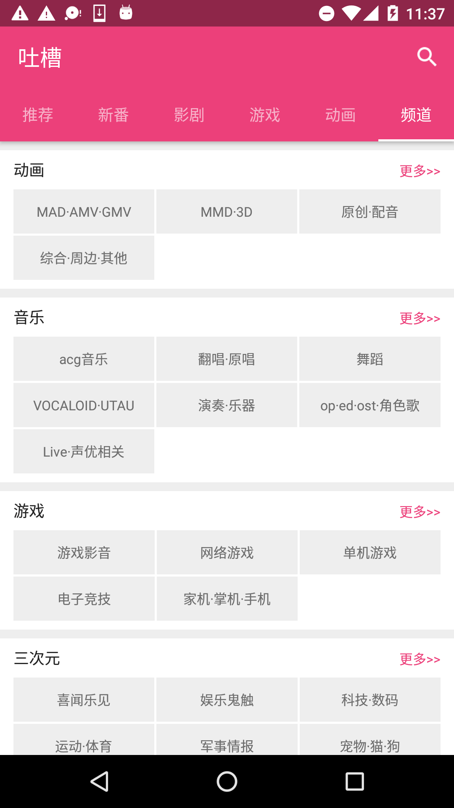
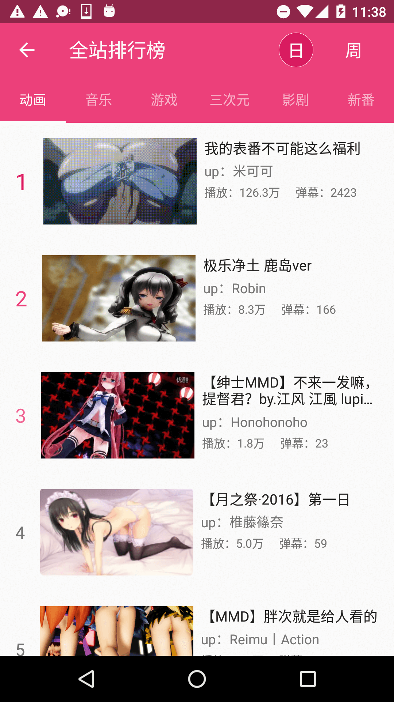
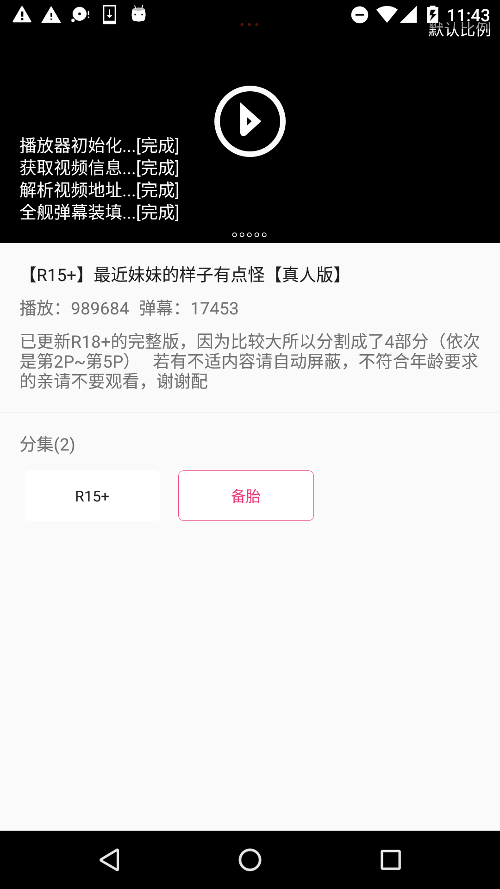
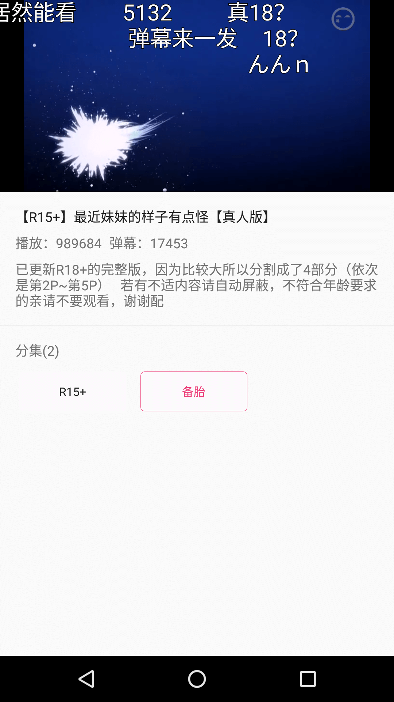
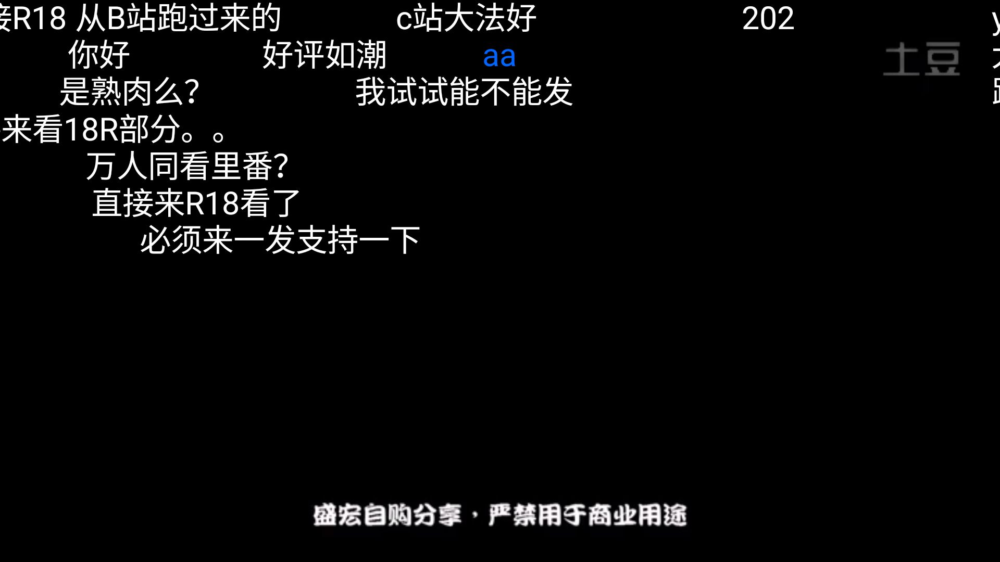
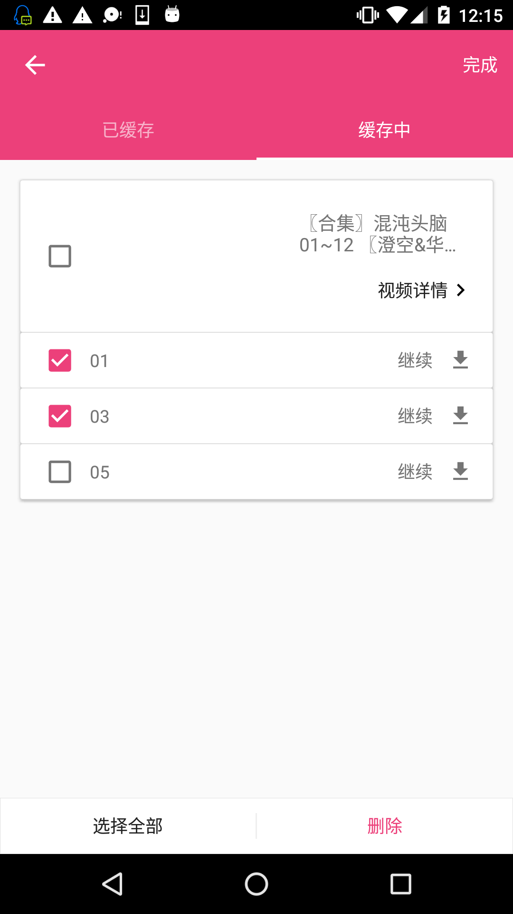
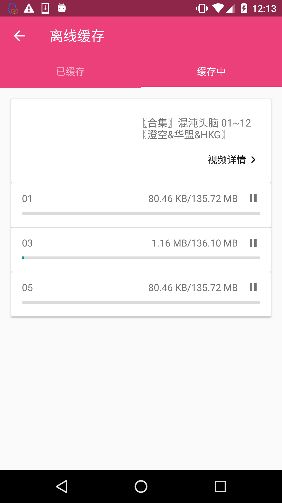

# Tucao

[](https://travis-ci.org/blackbbc/Tucao)
[](https://www.versioneye.com/user/projects/58f365330f9f35002b0bc851)
[](https://github.com/blackbbc/Tucao/releases)
[](https://github.com/blackbbc/Tucao/blob/master/LICENSE)


## 特色
- 首页六大模块，推荐、新番、影剧、游戏、动画、频道
- 全站排行榜，支持每日/每周排序
- 放映时间表，可以查看周一到周日新番的更新情况
- 频道列表，支持按照发布时间/播放量/弹幕排序
- 视频搜索，支持分频道搜索
- 视频查看，使用IjkPlayer播放视频，DanmakuFlameMaster播放弹幕，自动拼接多段视频（使用concat协议）
- 视频离线缓存，支持缓存弹幕
- 增量更新（[Google File By File Patch](https://github.com/andrewhayden/archive-patcher)）

## 截图
<a href="art/1.gif"></a>
<a href="art/2.gif"></a>
<a href="art/3.gif"></a>

<a href="art/4.gif"></a>

<a href="art/5.png"></a>
<a href="art/6.png"></a>
<a href="art/7.png"></a>

<a href="art/8.png"></a>
<a href="art/9.png"></a>
<a href="art/10.png"></a>

<a href="art/11.png"></a>
<a href="art/12.png"></a>
<a href="art/13.png"></a>

<a href="art/14.png"></a>
<a href="art/15.png"></a>
<a href="art/16.png"></a>

<a href="art/17.png"></a>
<a href="art/18.png"></a>
<a href="art/19.png"></a>

## 待做列表
- [ ] 同步收藏（接口不全）
- [ ] 发私信（接口不全）
- [ ] 查看私信（接口不全）
- [ ] 准备播放时会弹回主界面（无法重现）
- [ ] 修复播放时跳回开头的问题（无法100%重现，原因不明）

## 常见问题
- [常见问题](https://github.com/blackbbc/Tucao/blob/master/FAQ.md)

## 更新历史
- [更新历史](https://github.com/blackbbc/Tucao/blob/master/changelog.md)

## 开发指南
Android Studio 版本: [3.0](https://developer.android.com/studio/preview/index.html)

由于项目中使用了[子模块](https://git-scm.com/book/zh/v1/Git-工具-子模块)，请务必使用以下命令克隆项目
```
git clone --recursive -j8 https://github.com/blackbbc/Tucao.git
```

注意：由于`Studio 3.0`使用`google()`作为`maven库`，请自行扶墙!!!!!!!!

如果使用`Windows`进行开发，由于Data Binding在Windows上存在UTF8编码问题，不能编译通过，请参考如下两个Issue自行解决：
[#4](https://github.com/blackbbc/Tucao/issues/4) [#7](https://github.com/blackbbc/Tucao/issues/7)

- 热烈庆祝[Kotlin](https://kotlinlang.org/)成为Android开发一级语言，撒花～～～
- 设计编码均独立完成，如果你觉得太丑，欢迎砸设计稿
- 架构基于MVVM模式，使用`DataBinding` + `RxJava2` + `Dagger2` + `Retrofit`实现


## 免责声明
该项目仅供交流学习使用，如果该项目有侵犯Tucao版权问题，本人会及时删除此页面与整个项目。

## 感谢以下开源项目
- [Kotlin](https://github.com/JetBrains/kotlin)
- [RxJava](https://github.com/ReactiveX/RxJava)
- [RxLifecycle](https://github.com/trello/RxLifecycle)
- [RxDownload](https://github.com/ssseasonnn/RxDownload)
- [Retrofit](https://github.com/square/retrofit)
- [Dagger2](https://github.com/google/dagger)
- [EventBus](https://github.com/greenrobot/EventBus)
- [GSYVideoPlayer](https://github.com/CarGuo/GSYVideoPlayer)
- [ijkplayer](https://github.com/Bilibili/ijkplayer)
- [DanmakuFlameMaster](https://github.com/Bilibili/DanmakuFlameMaster)
- [Glide](https://github.com/bumptech/glide)
- [BaseRecyclerViewAdapterHelper](https://github.com/CymChad/BaseRecyclerViewAdapterHelper)
- [CrashWoodpecker](https://github.com/drakeet/CrashWoodpecker)
- [Leakcanary](https://github.com/square/leakcanary)
- [Convenientbanner](https://github.com/saiwu-bigkoo/Android-ConvenientBanner)
